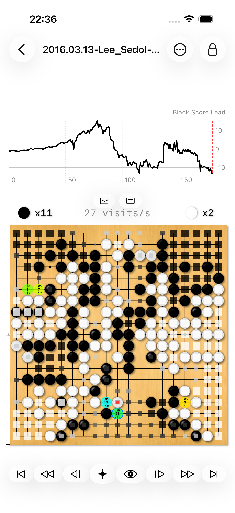
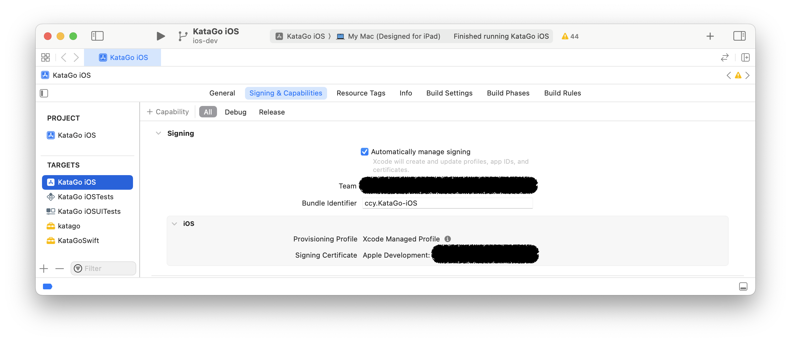
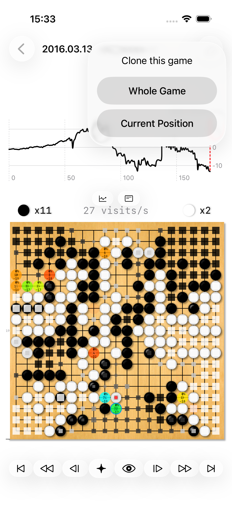
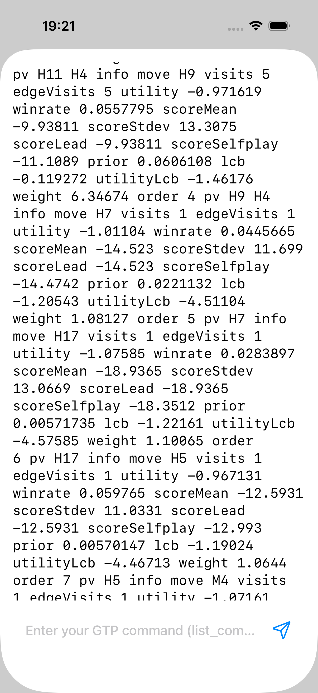
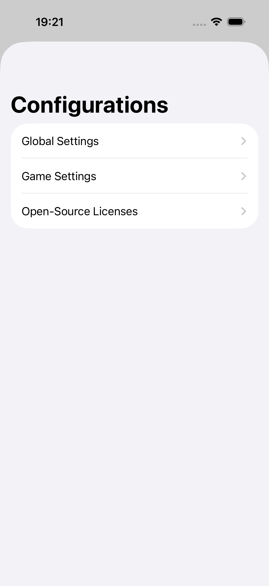

# Documentation for KataGo Anytime

## Overview
*KataGo Anytime* is a native [SwiftUI](https://developer.apple.com/xcode/swiftui/) app that wraps the [KataGo](https://github.com/ChinChangYang/KataGo/tree/metal-coreml-stable) engine, giving you a friendly graphical interface for Go analysis and play on Apple platforms. The app communicates with the embedded C++ engine over [GTP](https://github.com/ChinChangYang/KataGo/blob/metal-coreml-stable/docs/GTP_Extensions.md) and renders an interactive Go board.

It runs on **iOS 26+, macOS 26+ (native), and visionOS 26+**, and is optimized for power-efficient inference on Apple silicon. On iPhone, iPad, and Apple Vision Pro the engine runs on Apple's [Neural Engine](https://machinelearning.apple.com/research/neural-engine-transformers) (NE) via CoreML; on macOS it runs on the GPU via an [MLX](https://github.com/ml-explore/mlx) backend.



## Inference Backends and Power Efficiency
The app ships a single compiled C++ neural-network backend (MLX) that multiplexes two user-selectable inference paths:

- **CoreML/NE** — runs the network on Apple's Neural Engine via CoreML. This is the default on iOS and visionOS, prized for its power efficiency on mobile devices.
- **MLX/GPU** — runs the network on the GPU through MLX. This is the default on macOS.

You choose the backend **per neural-network model** from a settings sheet (see the [User Guide](#selecting-a-model-and-backend) below). The selection persists per model.

A few platform notes:

- On the **iOS/visionOS Simulator** the backend is always pinned to **CoreML/NE**, regardless of any stored preference, because MLX GPU inference crashes in the simulator's Metal translation layer. Real devices honor your stored preference.
- **Search threads** are set per platform at runtime: **2 threads** on iOS/visionOS (a deliberate trade-off for minimal power consumption and responsive interaction on battery-powered devices) and **16 threads** on macOS.
- The CoreML model is generated **on the fly** at runtime by converting the `.bin.gz` network into a CoreML model, which is then compiled and cached. You do **not** download or bundle a separate `.mlpackage`.

## Analysis of Benchmark Results
The following benchmarks were measured at a point in time on the [iPhone 12](https://support.apple.com/kb/SP830) and [iPad mini (6th generation)](https://support.apple.com/kb/SP850). They illustrate the CoreML Neural Engine (NE) backend's power efficiency relative to GPU processing on those devices.

> **Note:** These tables are **historical**, measured on KataGo `v1.14.0-coreml1` with the `b18c384nbt` network, before the app migrated to the current MLX-based backend architecture and newer default networks. The `CoreML GPU` and `Metal GPU` rows reflect that earlier build and are not separately selectable backends in the current app. The numbers are preserved here as point-in-time measurements and have not been re-measured against the current build.

### Benchmark Analysis for iPhone 12

- **Specifications**: Equipped with Apple's A14 Bionic chip, featuring a 6-core CPU, 4-core GPU, and a 16-core Neural Engine.
- **KataGo Version**: `v1.14.0-coreml1`
- **Neural Network Model**: `b18c384nbt`
- **Concurrency**: Limited to 2 search threads to optimize power efficiency.

#### Benchmark Table for iPhone 12

```
| Backend    | Visits/s | NnEvals/s | Power/5m    |
|------------|----------|-----------|-------------|
| CoreML NE  | 68.91    | 57.80     | 66% -> 61%  |
| CoreML GPU | 10.37    | 8.84      | 74% -> 67%  |
| Metal GPU  | 17.64    | 14.79     | 67% -> 62%  |
```

The CoreML NE backend demonstrates a significant efficiency advantage, achieving higher visit and evaluation rates while consuming less power, a testament to the Neural Engine's optimization for Go game analysis.

### Benchmark Analysis for iPad mini (6th generation)

- **Specifications**: Powered by the A15 Bionic chip with a 6-core CPU, 5-core GPU, and a 16-core Neural Engine.
- **KataGo Version**: `v1.14.0-coreml1`
- **Neural Network Model**: `b18c384nbt`
- **Concurrency**: Maintained at 2 search threads to ensure power efficiency.

#### Benchmark Table for iPad mini (6th generation)

```
| Backend    | Visits/s | NnEvals/s | Power/5m    |
|------------|----------|-----------|-------------|
| CoreML NE  | 79.42    | 66.83     | 57% -> 54%  |
| CoreML GPU | 17.06    | 14.44     | 63% -> 60%  |
| Metal GPU  | 31.27    | 26.61     | 66% -> 63%  |
```

On the iPad mini (6th generation), the CoreML NE backend not only sustains its lead in processing efficiency but also showcases an enhanced power-saving profile, further reinforcing the Neural Engine's role in optimizing the app for mobile platforms.

## Source Code Compilation Guidelines
The setup process involves preparing your development environment, cloning the repository, supplying the model resources, and configuring code signing. Follow these guidelines for a smooth build.

### Cloning the Project Repository
Clone the `ios-dev` branch from the repository maintained by `ChinChangYang` into a directory named `KataGo-ios-dev`:
```
git clone https://github.com/ChinChangYang/KataGo.git -b ios-dev KataGo-ios-dev
```

Transition into the directory specific to the app:
```
cd KataGo-ios-dev/ios/KataGo\ iOS
```

### Acquiring Necessary Resources
The app loads its model files from the `Resources/` directory. These `.bin.gz` networks are gitignored and must be supplied by you before building. Place the following files in `Resources/`:

- `default_model.bin.gz` — the built-in KataGo network (an 18-block `b18c384nbt` net).
- `b18c384nbt-humanv0.bin.gz` — the human-style (human SL) network used for human-like profiles.
- `default_gtp.cfg` — the GTP configuration (already present in the repository).

You do **not** need to download or unzip a CoreML `.mlpackage`. The app converts the `.bin.gz` network into a CoreML model on the fly at runtime and caches the result.

> **Note:** Additional neural networks (including a downloadable 40-block "Official KataGo Network" and several community nets) are downloaded **in-app at runtime** through the model picker; they do not need to be placed in `Resources/`. See [Selecting a Model and Backend](#selecting-a-model-and-backend).

### Configuring the Project in Xcode
Open the project in [Xcode](https://developer.apple.com/xcode/):
```
open "KataGo Anytime.xcodeproj"
```

The primary scheme is **KataGo Anytime**.

Configure code signing in Xcode under the project's "Signing & Capabilities" section. Select an appropriate code signing identity and development team, typically linked to an Apple Development certificate and a Team ID registered with the Apple Developer Program.

Refer to the screenshot below for guidance on configuring code signing in Xcode:



### Building and Running the Application
You can build and run from Xcode via "Product -> Run" (or `Command + R`), targeting a simulator or connected device.

The app builds for all three supported platforms. From the command line:
```
# Build for iOS Simulator
xcodebuild build -project "KataGo Anytime.xcodeproj" -scheme "KataGo Anytime" -destination 'platform=iOS Simulator,name=iPhone 17' -configuration Debug

# Build for macOS
xcodebuild build -project "KataGo Anytime.xcodeproj" -scheme "KataGo Anytime" -destination 'platform=macOS' -configuration Debug

# Build for visionOS Simulator
xcodebuild build -project "KataGo Anytime.xcodeproj" -scheme "KataGo Anytime" -destination 'platform=visionOS Simulator,name=Apple Vision Pro' -configuration Debug
```

Tests run on the iOS Simulator (the test target does not support macOS or visionOS):
```
xcodebuild test -project "KataGo Anytime.xcodeproj" -scheme "KataGo Anytime" -destination 'platform=iOS Simulator,name=iPhone 17'
```

### Install Apps from Outside the App Store

**Problem: Installing Apps from Outside the App Store**

* **Cause:** iOS devices are designed to prioritize security and primarily install applications from Apple's App Store. Apps compiled from source code are not automatically trusted.
* **Symptoms:** When trying to install the app, you receive an error message similar to "Untrusted Developer."

**Solution: Manually Trusting the Developer**

1. **Attempt Installation:**  Try to build and run the app as instructed in this documentation. If you receive an "Untrusted Developer" error, proceed to the next steps.

2. **Open Settings:**
   * Locate the Settings app on your iPhone or iPad.

3. **Find Device Management:**
   * Navigate to either:
     * "General" -> "Device Management"
     * "General" -> "VPN & Device Management"
     * **Note:** The exact location may vary depending on your iOS version.

4. **Locate the App Profile:**
   * Under "Device Management" look for a profile related to the app. It might be named after you.

5. **Trust the App:**
   * Tap on the app profile.
   * Choose the option to "Trust" or "Verify App."

6. **Reattempt Installation:**  The installation process should now proceed.

**Important Notes:**

* **Temporary Trust:**  Developer certificates and trusted profiles sometimes expire. You may need to repeat this process periodically.

## User Guide
This guide walks you through the application's primary functionality.

### Navigating the Interface
The app is **not** organized as a set of tabs. Instead, it uses a [`NavigationSplitView`](https://developer.apple.com/documentation/swiftui/navigationsplitview):

- A **sidebar** titled **Games** lists your saved games. It is a searchable, selectable list with swipe-to-delete. Selecting a row opens that game in the detail view.
- A **detail** view shows the Go board (`GobanView`) for the selected game. If no game is selected, it shows a "Select a game" placeholder; if the board is larger than the selected model supports, it shows a "Too large board size" message.

On a fresh launch (when no model has been chosen yet) the first screen is the **model picker**, followed by a loading screen while the engine initializes, and then the split view.

On **visionOS**, the board toolbar adds an Expand/Collapse full-screen button that toggles the sidebar in and out of view.

#### Selecting a Model and Backend
Before you can play, you select a neural network from the **model picker**:

- The picker lists the built-in 18-block network plus several downloadable networks, including a 40-block **"Official KataGo Network"** and several community nets.
- Each network has a single status button that changes with its state: a **download arrow** when the net isn't downloaded yet (tap to download), a **stop** icon while downloading, and a **play** button once the file is present (tap to launch the engine with that net).
- Tap the gear/settings button on a model to open its **Backend** settings sheet. Here you choose the inference backend (**MLX/GPU** or **CoreML/NE**, via a segmented control) and a board-size option.
  - For **MLX/GPU**, you can also set a **Max Board Size** (9 / 13 / 19 / 37, default 19), a Winograd autotuner mode (**Fast** or **Full**), and a one-shot "Re-tune on next load" toggle.
  - For **CoreML/NE**, you set a **Compiled Board Size** (9 / 13 / 19 / 37, default 19).

The chosen backend and board size persist per model.

#### Playing on the Board
The board itself is where you play and review:

- **Place a move** by tapping an intersection. To **pass**, tap the dedicated pass cell. The engine validates move legality before the stone is placed.
- The AI plays its moves automatically according to your per-game AI configuration; there is no manual "next move" button.
- When you play a move while reviewing earlier history (not at the latest move), the app starts a temporary **branch** (see [Branch Mode](#branch-mode)).

#### The Board Control Strip
Below the board is a control strip with eight buttons for navigation, analysis, and overlay visibility:

- **Backward to End** — jump to the first move.
- **Backward** — step back 10 moves.
- **Backward Frame** — step back 1 move.
- **Toggle Analysis** (the sparkle button) — a single button that cycles the analysis state: start (run), pause, and stop (clear).
- **Toggle Visibility** (the eye button) — cycles the analysis-overlay visibility: opened, book (when a compatible opening book is loaded), and closed.
- **Forward Frame** — step forward 1 move.
- **Forward** — step forward 10 moves.
- **Forward to End** — jump to the latest move.

#### The "More" Menu
A **More** menu (the ellipsis-circle button) in the toolbar provides game and app actions, including **New Game**, **Clone**, **Import**, **Share**, **Delete**, a thumbnail-size toggle, **Configurations**, and **Developer Mode**. A **Quit** button is also available from the sidebar toolbar.

#### Cloning a Game
Tapping **Clone** asks how much of the game to copy:

- **Whole Game** — a full copy.
- **Current Position** — a copy truncated to the move you're currently viewing; later moves are dropped, so the copy starts from that position. Handy for practicing a particular position later.



#### Developer Mode (GTP Console)
The raw [GTP command](https://github.com/ChinChangYang/KataGo/blob/metal-coreml-stable/docs/GTP_Extensions.md) console still exists, but it is now reached through **More -> Developer Mode**, which opens as a sheet. It shows a scrolling message log and a text field for entering GTP commands (e.g. `list_commands`).



#### Branch Mode
When you play a move while reviewing earlier history (and not editing), the app enters **branch mode**: it snapshots the current line so your exploratory stones don't overwrite the saved game. While a branch is active, the board is drawn with a **red border** to remind you that the branch stones are temporary, and the detail toolbar shows a **Deactivate Branch** button.

Deactivating a branch presents a **two-stage confirmation**:

1. First, you choose **Replace** or **Discard Branch**.
2. Then a second, destructive confirmation finalizes your choice — either replacing the saved game's line with the branch (dropping moves after the divergence point) or discarding the branch entirely.

### Configurations
Settings are reached through **More -> Configurations**, which presents a hierarchical settings sheet (not a tab) titled **Configurations** with three sections:

- **Global Settings** — app-wide preferences, synced via `@AppStorage`.
- **Game Settings** — per-game settings for the currently selected game.
- **Open-Source Licenses** — third-party license information.



#### Global Settings
Global Settings are app-wide and are grouped into three sections:

- **Board**
  - **Stone style** — Fast or Classic (default Fast).
  - **Move numbers** — Last 3 moves, Last move, All moves, or Marker (default Last 3 moves).
  - **Show coordinate**, **Show pass**, **Vertical flip**, and **Show chart/comments** toggles.
- **Analysis**
  - **Analysis information** — Winrate, Score, All, or None (default All).
  - **Analysis style** — Fast or Classic (default Fast).
  - **Show ownership** and **Show win rate bar** toggles.
- **Sound & Haptics**
  - **Sound effect** toggle — randomized stone-placement and capture sounds.
  - **Haptic feedback** toggle.
  - **Show visits/s** toggle.

#### Game Settings
Game Settings apply to the currently selected game and are organized into six sub-screens:

- **Name** — the game's name.
- **Rule** — Board width and height (each 2 to the maximum, default 19x19), Ko rule (Simple / Positional / Situational), Scoring rule (Area / Territory), Tax rule (None / Seki / All), Multi-stone suicide toggle, Has-button toggle, White handicap bonus, and Komi (default 7.0).
- **Analysis** — **Analysis for** (Both / Black / White), Hidden analysis visit ratio, Analysis wide root noise, **Max analysis moves** (1-1000, default 50), and **Analysis interval** (10-300 in steps of 10, default 50).
- **AI** — White advantage (playout doubling advantage), plus per-color Black AI / White AI sections, each with a human-style profile picker and a "Time per move" control (0-60 seconds).
- **Comment** — an **Apple Intelligence** toggle, a commentary **Tone** picker (Technical, Educational, Encouraging, Enthusiastic, Poetic; default Technical), and a **Temperature** stepper (0-1, step 0.1).
- **SGF** — paste SGF text to load a game; the app parses the board size, rules, and komi and reloads the game.

> The earlier README's `Max Message Characters` and `Max Message Lines` settings no longer exist.

### On-Device AI Commentary
The app can generate natural-language commentary for moves entirely on-device using Apple's [FoundationModels](https://developer.apple.com/documentation/foundationmodels) framework. Commentary respects the configured tone and temperature, and falls back to a deterministic, natural-language comment if generation is unavailable. Enable it via **Game Settings -> Comment -> Apple Intelligence**.

### Saved Games, Import, Export, and Sync
- Games are persisted with **SwiftData** and synced across your devices via **CloudKit** (iCloud).
- **Import** SGF via the document picker (More -> Import) or by dragging an SGF onto the app.
- **Export / Share** the current game as SGF via the Share action in the More menu.
