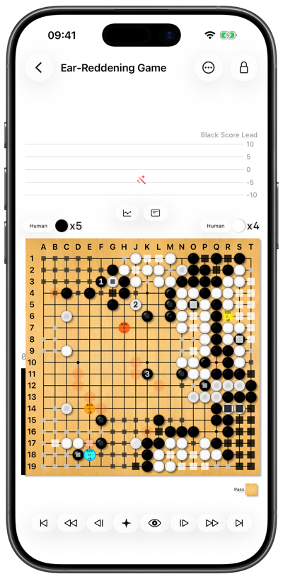
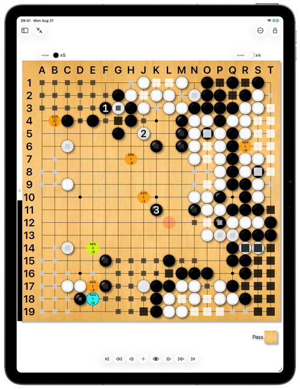
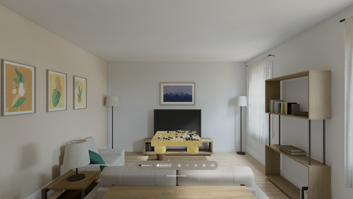
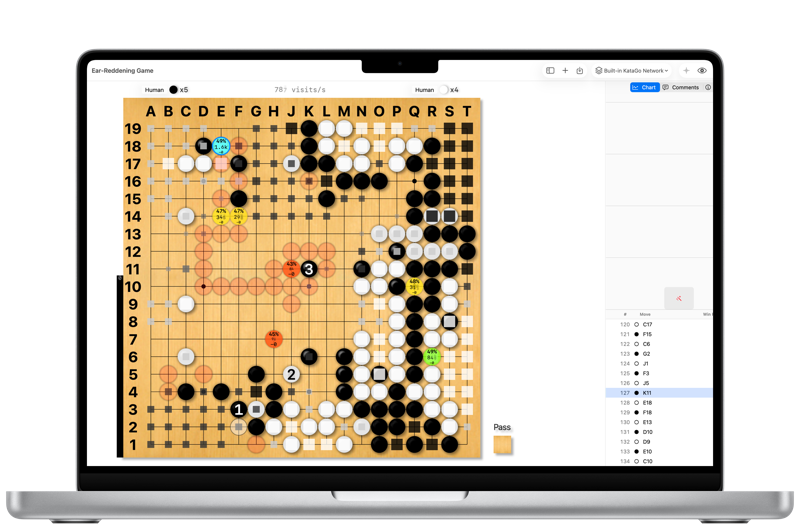
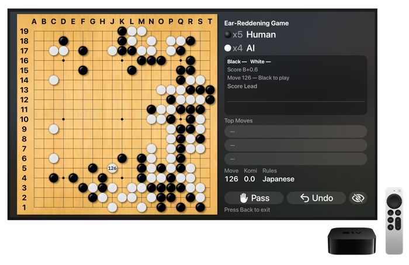
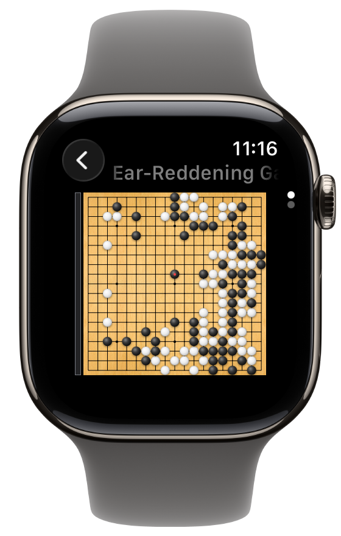

# KataGo Anytime

*KataGo Anytime* is a suite of native Apple apps that wraps the [KataGo](https://github.com/ChinChangYang/KataGo/tree/ios-dev) engine, giving you a friendly graphical interface for Go analysis and play across Apple devices. The apps talk to the embedded C++ engine over [GTP](https://github.com/ChinChangYang/KataGo/blob/ios-dev/docs/GTP_Extensions.md) and render an interactive Go board.

<!-- screenshot:iphone-board -->


*Captured with build 307 on 2026-08-31; regenerate with `Screenshots/capture_screenshots.sh`.*

It runs on **iPhone and iPad, Apple Vision Pro, Mac, Apple TV, and Apple Watch** (all on OS 26+), with your game library synced between devices via iCloud. Inference is optimized for Apple silicon: the engine runs the neural network on Apple's [Neural Engine](https://machinelearning.apple.com/research/neural-engine-transformers) via Core ML, on the GPU via [MLX](https://github.com/ml-explore/mlx), or on both in parallel.

## The Apps at a Glance

| Platform | Xcode scheme | What you get |
|----------|--------------|--------------|
| iOS / iPadOS 26+ | `KataGo Anytime` | Full play & analysis app (SwiftUI) |
| visionOS 26+ | `KataGo Anytime Vision` | Volumetric RealityKit app — a real-scale 3D goban played with a game controller |
| macOS 26+ | `KataGo Anytime Mac` | Native AppKit app with a three-pane window and menu-bar/hotkey workflow |
| tvOS 26+ | `KataGo Anytime TV` | Review, spectate, and play ranked games against KataGo — for the living room |
| watchOS 26+ | `KataGo Anytime Watch` | Standalone read-only game library, synced over iCloud |

Beyond the apps themselves:

- A **Saved Game widget** (iOS, iPadOS, macOS, visionOS) puts a chosen game's board and comments on your Home Screen or desktop.
- A **Last Game complication** on Apple Watch shows the name and comment at the position your last game is parked on.
- A **Safari extension** (macOS and iOS) blends KataGo analysis into Go games you find on the web — see [KataGo Anytime in Safari](#katago-anytime-in-safari).
- A **Messages extension** plays engine-free, human-vs-human correspondence Go inside a Messages thread — see [KataGo Anytime in Messages](#katago-anytime-in-messages).
- Games are persisted with **SwiftData** and synced everywhere via **CloudKit** (iCloud).

## Engine, Neural Networks, and Opening Books

### Inference Backends

All apps compile a single C++ neural-network backend (MLX) that multiplexes two inference paths: **CoreML/NE** (Apple's Neural Engine) and **MLX/GPU**. What actually runs differs per platform:

- **iOS** is the only platform with a backend picker. You configure the backend **per neural-network model** from the model's settings sheet (the gear on its detail screen):
  - **Backend** — a three-way choice: **MLX/GPU**, **CoreML/NE** (the default, prized for power efficiency), or **GPU+ANE**, a mux that runs the GPU and the Neural Engine in parallel for higher throughput.
  - **Core ML Routing** — a readout of how Core ML routes this network's operations across compute units, there to inform the Backend choice: if most operations land on the CPU, MLX/GPU is the better pick.
  - **Max Board Size** — 9 / 13 / 19 / 37 (default 19). Sets the largest playable board and the neural-net buffer geometry.
  - **Search Threads** — a stepper from 1 to 32 (default 2), persisted per model.
  - **Performance Tuning** — shown when the backend uses the GPU: a Winograd autotuning mode (**Fast** or **Full**) plus a one-shot **Re-tune on next load** toggle.
- On the **iOS/visionOS Simulator** the backend is always pinned to **CoreML/NE**, regardless of any stored preference, because MLX GPU inference crashes in the simulator's Metal translation layer. Real devices honor your stored preference.
- On **macOS** there is no backend picker: the engine always runs a fixed mux of **1 MLX/GPU + 2 CoreML/NE** server threads with **16 search threads**, inside a sandboxed `katago-engine` subprocess (one per window) that the app drives over GTP pipes.
- On **Apple Vision Pro** the engine runs in-process on **CoreML/NE only** — the GPU belongs to the 90 Hz compositor.
- On **Apple TV** the engine runs in-process through **Core ML pinned to the CPU and GPU** — Apple TV's Neural Engine never takes the network, and the MLX/GPU path is deliberately left out to stay inside tvOS's tight memory limit.
- The Core ML model is generated **on the fly** at runtime by converting the `.bin.gz` network, then compiled and cached. The cache keeps the most recently used compiled models — up to **10** main-network variants and **4** human-SL variants — and the model picker's **Core ML Cache** footer shows what is cached and offers **Clear Cache**. You never download or bundle a separate `.mlpackage`.

### Neural Network Models

The model picker offers the built-in 18-block `b18c384nbt` network plus eight downloadable nets:

- **Official KataGo Network** — 40-block `b40c768` (~863 MB), the strongest option.
- **FD3 Network** (~271 MB) and **Strong Large Board Net M2** (~271 MB).
- **Strong Igo Hatsuyoron 120 Net** (~174 MB), specialized for the famous tsumego.
- **Finetuned 9x9 Network** (~98 MB) and **Short Distributed Test Run Rect15 Final Net** (~87 MB).
- **Lionffen b6c64** (~2 MB) and **Lionffen b24c64** (~5 MB), tiny community nets that run very fast (both are capped at 19x19 boards).

Each network is a row showing its title, with a green checkmark once its Core ML model is compiled and cached. Opening the row shows the network's detail screen: a description, a status button — a download arrow, a stop icon while downloading, a resume arrow for a paused download, then a play button to launch the engine — plus a gear for the backend settings above and a trash button to remove the downloaded file. On Apple TV the list carries the built-in net plus downloadable nets of 100 MB or less. A separate human-style (human SL) network powers the rank and pro profiles described under [Game Settings](#settings), bundled on every platform including Apple TV.

Below those lists, a **Custom Networks** section takes any KataGo network file (`.bin.gz`) you already have. **Add Custom Network…** opens a file picker, checks there is room, copies the file with byte-accurate progress you can cancel, and refuses anything the engine cannot load. Custom networks **stay on this device** — they are never synced — and each has its own detail screen with editable notes, a play button, and backend settings; rows delete with a swipe. The Mac offers the same list under **Window ▸ Manage Models…**.

### Opening Books

The model picker also links to an **Opening Books** screen with downloadable books for **6x6, 7x7, 8x8, and 9x9** boards (Japanese-like rules). You can also bring your own: **Import Book…** takes a KataGo book file (`.kbook` or `.kbook.gz`) for any square board from 2x2 to 15x15, and when a size has more than one book an **Active Books** section chooses which one the board shows. When the current game's board size has a book, the board's eye button gains a **book** state that overlays the book's candidate moves and evaluations.

## Using the App on iPhone and iPad

### Navigating

The app uses a [`NavigationSplitView`](https://developer.apple.com/documentation/swiftui/navigationsplitview):

- A **sidebar** titled **Games** lists your saved games as thumbnails — searchable, with swipe-to-delete, and a **Select** mode for bulk deletion.
- The **detail** view shows the Go board for the selected game.

The board comes up first, on every launch. Your last game's stones, the move numbers and every navigation control are there immediately; the engine loads in the background, with a "Loading engine…" line over the board (and "Compiling Core ML model…" underneath while a compile is genuinely running) that disappears once it is ready. If the engine fails, or a board is larger than the launched Max Board Size, the analysis sparkle button wears a warning badge; tapping it opens the model picker, whose status header names the problem and offers the remedy — **Retry**, raise Max Board Size, or switch networks. Debug builds present the **model picker** as a sheet over that already-mounted board; release builds restore your last network, or launch the built-in one. On **iPad** a Full-Screen button hides the info pane and sidebar so the board fills the display.

<!-- screenshot:ipad-board -->


*Captured with build 307 on 2026-08-31; regenerate with `Screenshots/capture_screenshots.sh`.*

### Playing and Reviewing

- **Place a move** by tapping an intersection (the engine validates legality first). To **pass**, tap the dedicated pass cell.
- Played, replayed and undone stones **settle onto the board**, and the stones a move captures fade away as the capturing stone lands; jumps, chart scrubs and game switches are instant, and with **Reduce Motion** on stones cross-fade instead of moving.
- **Tap a player's capsule** (the label showing "AI", a rank, or "Human" beside the captured-stone count) to toggle that side between Human and AI play. **Long-press it** to pick that side's rank from a menu — Full Strength, Dan, Kyu, or Pro by decade; picking a rank for a Human side hands it to KataGo at that rank, and a pick takes effect at once unless the engine is mid-think, in which case it applies from its next move.
- Below the board, a control strip has eight buttons: **Backward to End**, **Backward** (10 moves), **Backward Frame** (1 move), **Toggle Analysis** (the sparkle button cycles run → pause → clear), **Toggle Visibility** (the eye button cycles the analysis overlay: opened → book, when an opening book applies → closed), **Forward Frame**, **Forward** (10 moves), and **Forward to End**.
- The toolbar carries a **Lock/Unlock** button that guards the saved game against accidental edits; while a branch is active its place is taken by the red **Deactivate Branch** button.
- Win-rate bar, ownership shading, candidate moves, and the score chart draw over and under the board according to your settings; the chart supports tap/drag navigation and an auto-play button.

**Branch mode.** When you play a move while reviewing earlier history (and not editing), the app snapshots the current line so your exploratory stones don't overwrite the saved game. While a branch is active the board is drawn with a **red border**, and the toolbar shows a **Deactivate Branch** button. Deactivating presents a two-stage confirmation: choose **Replace** or **Discard Branch**, then a second, destructive confirmation finalizes your choice — either replacing the saved game's line with the branch or discarding the branch entirely.

### The More Menu

The **More** menu (the ellipsis-circle button) in the toolbar has five doors:

- **New Game** — an **Empty Board**, or **Clone Current Game**. Cloning asks how much to copy: **Whole Game** (a full copy) or **Current Position** (a copy truncated to the move you're viewing — later moves are dropped, handy for practicing a position later).
- **Import** — from a **File** (SGF or image) or a **Photo** or the **Camera** (see [photo import](#import-a-game-from-a-photo)).
- **Select** — enter multi-select mode in the games list.
- **This Game** — a submenu for the selected game: **Share** (export SGF), **Export GIF**, **Listen** (an audio narration of the game, move by move, with playback controls), **Deep Report**, and **Delete**.
- **Settings** — a submenu holding **Game Settings** (per-game) and **Global Settings** (app-wide).

## Feature Highlights

### Import a Game from a Photo

Import a real-world board position from a photo (**More → Import → Photo**), a live **Camera** capture (**More → Import → Camera**, on iPhone and iPad when a back camera is available, with an on-screen guide for framing the board), or an image file via **More → Import → File**. (Drag-and-drop onto the app imports SGF text and files, not images.)

- On-device computer vision recognizes the board and stones and shows a preview with **black/white stone counts** and a **confidence** score.
- **Tap any intersection to correct it** — taps cycle empty → black → white — and a **Reset** button undoes your edits.
- If the recognition looked at the wrong region, **Adjust Grid** lets you place the board's grid corners yourself, pick the board size, and run **Recognize** again.
- Pick who plays next with the **Next to play** selector, then import; the position becomes a regular saved game.

### Deep Analysis Report

**More → This Game → Deep Report** runs a structured probe of the current position and presents:

- Two candidates — the **best move** and an **alternative you choose** via **Pick an alternative…** — each with winrate, score lead, and visits, a principal-variation board that can toggle to an **ownership-change** view, and a follow-up if the opponent plays elsewhere (tenuki).
- A **Playing vs. Passing** comparison showing what the position is worth, with the **most contested** regions listed.
- A streamed natural-language **summary** of the findings, with **Regenerate**, **Refine** (re-runs the probe with a larger search budget), and **Copy to Comment** actions.

### GIF Export

**More → This Game → Export GIF** renders the game as an animated GIF with a live preview: playback speed (0.2–1.5 s per move), **Low (320 px)** or **High (640 px)** quality, a final-frame hold, coordinate and loop toggles, and a share sheet for the result.

### On-Device AI Commentary

The app can generate natural-language commentary for moves entirely on-device using Apple's [FoundationModels](https://developer.apple.com/documentation/foundationmodels) framework. Commentary respects the configured tone and temperature, and falls back to a deterministic, natural-language comment if generation is unavailable. Enable it via **Game Settings → Comment → Apple Intelligence**.

### Saved Game Widget

Add the **Saved Game** widget (small through extra-large) to your Home Screen or Mac desktop. It renders a crisp vector board of the game's displayed move together with that move's comment, and each widget can be configured to follow a different saved game. Tapping the widget deep-links straight to that game.

### Siri Shortcuts and Power Saving

- App Intents expose seven actions to Siri and the Shortcuts app. Four work on iOS and macOS alike: **"Get Go Game Information"** and **"Open Go Game"** (both for a game you pick), plus **"Get Latest Go Game"** and **"Open Latest Go Game"**. Three more are iOS-only: **"Listen to Go Game"**, **"Listen to Latest Go Game"**, and **"Resume Listening"**.
- The exact phrases to say are listed in-app — **Global Settings → Siri → Siri Phrases** on iOS, **Settings → Siri** on the Mac — grouped Discover / Open (plus Listen on iOS), with your newest game's name filled into the phrases that take one and a link to the Shortcuts app.
- In human-vs-AI games, when the analysis overlay is hidden and it's the human's turn, the app **pauses continuous analysis to save power** (iOS, visionOS, and tvOS); revealing the overlay resumes it.

## Settings

Settings are split in two: **More → Settings → Global Settings** opens the app-wide sheet (available with or without a selected game), while per-game configuration lives under **More → Settings → Game Settings**. Global Settings groups app-wide preferences plus an **Engine** section (running model/version and **Developer Mode**) and **Open-Source Licenses**.

### Global Settings

App-wide preferences in seven groups:

- **Board** — Stone style (Fast / Classic), Move numbers (Last 3 moves / Last move / All moves / Marker), Show coordinate, Show pass, Vertical flip, and Show chart/comments.
- **Analysis** — Analysis information (Winrate / Score / All / None), Analysis style (Fast / Classic), Show ownership, Show win rate bar.
- **Sound & Haptics** — Sound effect, Haptic feedback, Show visits/s.
- **Power** — Keep Screen Awake for AI Moves (iOS/iPadOS; on by default): the screen stays on while KataGo thinks, for a few seconds after it plays, and during auto-play.
- **Accessibility** — a **Voice Control** help screen listing the phrases that drive the board, worded per platform ("Tap K 10" on iOS, "Click K 10" on the Mac). Every intersection and the pass tile are exposed as named targets, so Voice Control and VoiceOver can play moves through the same legality checks as a tap.
- **Siri** — a **Siri Phrases** help screen listing the spoken phrase for every App Shortcut ("Open the latest go game with KataGo Anytime", …) plus the variants Siri also accepts, and a link to the Shortcuts app.
- **Game List** — Thumbnails (Off / Small / Large).

### Engine

Shows the running **Model** (or "None" when nothing is loaded) and engine **Version**; tapping either opens **Change model** — the picker comes up as a sheet over the board, and choosing a network restarts the engine in place. Nothing is torn down and no game is closed. This section also hosts **Developer Mode**, a raw [GTP command](https://github.com/ChinChangYang/KataGo/blob/ios-dev/docs/GTP_Extensions.md) console with a scrolling message log and a text field for commands such as `list_commands`.

### Game Settings

Per-game settings in six sub-screens:

- **Name** — the game's name.
- **Rule** — a **Ruleset** picker with eleven named presets (Chinese, Chinese (OGS/KGS), Japanese, Korean, AGA, BGA, AGA Button, New Zealand, Tromp-Taylor, Stone Scoring, Ancient Territory) plus **Custom**, sitting over the individual knobs: Board width and height (default 19x19), Ko rule (Simple / Positional / Situational), Scoring rule (Area / Territory), Tax rule (None / Seki / All), Multi-stone suicide, Has button, White handicap bonus, and Komi (default 7.5). New games default to the **Tromp-Taylor** preset. Presets are expanded by the engine's own SGF rules parser so they cannot drift, and editing any individual knob flips the picker to **Custom**. The Mac carries the same picker in its Config editor and New Game dialog.
- **Analysis** — Analysis for (Both / Black / White), Hidden analysis visit ratio, Analysis wide root noise, Max analysis moves (default 50), and Analysis interval (10–300, default 50).
- **AI** — White advantage (playout doubling advantage), plus a per-side profile picker: **AI** (the full-strength engine, with a 0–60 s "Time per move" control), human-style ranks **9d through 25k**, or **Pro 1800 through Pro 2023** profiles. For a rank or pro profile the time control is replaced by an **"Engine plays this side"** toggle. Rank and pro profiles play with a fixed visit budget so that rank means strength (400 visits for 9d and pro profiles, 40 for the rest), and a side left as Human is still analyzed with the strongest network.
- **Comment** — the **Apple Intelligence** toggle, a commentary **Tone** picker (Technical, Educational, Encouraging, Enthusiastic, Poetic), and a **Temperature** stepper (0–1).
- **SGF** — view, paste, or edit the game's SGF text directly.

## KataGo Anytime on Apple Vision Pro

<!-- screenshot:vision-volume -->


*Captured with build 307 on 2026-08-31; regenerate with `Screenshots/capture_screenshots.sh`.*

The Vision Pro app is a separate target (`KataGo Anytime Vision`) — not the iPhone app in a window. It opens a **volumetric window** containing a real-scale 3D goban built in RealityKit (about 0.46 x 0.50 m for a 19x19), with stones, candidate-move markers, and ownership squares placed in the scene:

- **A game controller plays the moves.** The left stick or D-pad glides a ghost stone across the board, **A** plays it, **Y** passes, **B** shows/hides the analysis overlay, **X**/**L1** step back and **R1** steps forward (hold **L1** or **R1** to repeat), and **L2**/**R2** jump to the start and end of the game. Until a controller connects the app says **Connect a controller to play**; a mapping legend appears automatically the first time one does. Pinch works on the flat ornaments — menus, the game list, settings — but not on the board itself.
- **Ornaments** ring the volume: a bottom-front bar with the player chips (pinch one to flip that side between Human and AI), a lock button (Lock/Unlock — or the red **Deactivate Branch** with its Replace/Discard confirmation while a branch is active), a Games toggle, the analysis sparkle, a Settings gear, and the controller legend. The Games ornament lists your iCloud-synced games — with a **Select** mode for bulk deletion — and carries **New Game**: 9x9 / 13x13 / 19x19 quick sizes plus a **Custom** card with width and height steppers for any rectangle.
- **Settings** (right-side card) holds Analysis information (Winrate / Score / All / None), Show ownership, a **Stand board up** toggle between tabletop and standing, **Neural Net** (opens the Models card), and Open-Source Licenses. Each model's **Max Board Size** sits behind its gear in the Models card; changing it restarts the engine with a new neural-net buffer **in the background** — the goban stays on screen and L1/R1 keep stepping through the game while it reloads.
- The engine runs **in-process on CoreML/NE only** — the GPU belongs to the 90 Hz compositor. A game larger than the launched Max Board Size still opens and draws; a card over the goban explains that analysis is off until you raise Max Board Size (or switch to a network that allows a larger one). Only a board outside the 2x2–37x37 range the 3D geometry covers is refused outright.

The Saved Game widget and `katago-anytime://` deep links work here too.

## KataGo Anytime on the Mac

<!-- screenshot:mac-window -->


*Captured with build 307 on 2026-08-31; regenerate with `Screenshots/capture_screenshots.sh`.*

The Mac app is native AppKit with a three-pane window:

- A **library sidebar** of your games (live-refreshed as iCloud changes arrive from other devices).
- The **board** in the center.
- An **inspector** with three tabs — **Chart** (score chart stacked over the moves list), **Comments**, and **Info** — switchable with **⌘1–⌘3**.

Everything is reachable from the menu bar: File (New Game, Import, Share, Export GIF, **Re-sync from iCloud**), Edit (Delete ⌘⌫), Game (Allow Editing ⌘E, Play Best Move, Pass, Deactivate Branch, Deep Analysis Report), Analysis (toggle/pause/clear, ownership), View (Toggle Sidebar ⌃⌘S, Toggle Inspector ⌃⌘I, the ⌘1–⌘3 inspector tabs, Show Coordinates, Show Pass, a Board/Book View submenu, Show Win-Rate Bar, Show Visits per Second, Enter Full Screen), Navigate, and Window (**Manage Models**, **Manage Opening Books**). Move navigation is keyboard-driven: **↑ / ↓** step one move back/forward, **← / →** jump ten, and **⌥⌘← / ⌥⌘→** go to the start/end of the game. LizzieYzy-style bare-key hotkeys work whenever you're not typing: **Space** toggles analysis, **,** plays the engine's best move, and **P** passes. Hovering the score chart previews a position; clicking commits the board to it.

- **Save** ⌘S — commit the game you are editing to iCloud. While a game is
  unlocked its changes are unsaved: they live in memory and in a local
  recovery file, and never reach iCloud until you save.
- **Revert to Saved** — throw away unsaved changes and reload the saved game.

A new game (⌘N) has no library row until you save it. Switching games,
closing the window or quitting with unsaved changes asks first.

Under the hood the Mac app runs the engine in the sandboxed `katago-engine` subprocess described in [Inference Backends](#inference-backends), so an engine crash never takes the app down. The board and all three inspector tabs mount as soon as a game is selected — they never wait for the helper to finish loading. While it loads, a "Loading engine…" line sits over the board; if the helper dies, the Analyze toolbar button wears a warning badge, and the **Manage Models** window's status header explains what happened and offers **Retry** — analysis resumes on the same position once the engine comes back.

## KataGo Anytime on Apple TV

<!-- screenshot:tv-play -->


*Captured with build 307 on 2026-08-31; regenerate with `Screenshots/capture_screenshots.sh`.*

The Apple TV app reviews, spectates, **and plays ranked games against KataGo**:

- **Library** — your iCloud-synced games in a grid (with sync-aware empty states while iCloud is catching up), plus **Search** and **Settings** tabs. A permanent **Play KataGo** card opens **New Game**. Unfinished human-vs-AI games — including ones started on iPhone, iPad, or Mac — show a **Continue** badge and reopen for play; finished or symmetric (AI-vs-AI) games open the read-only review as usual.
- **New Game** — board size (9x9 / 13x13 / 19x19 quick sizes, or a custom width/height picker up to the current Max Board Size), the same eleven named ruleset presets as [Game Settings](#settings), KataGo's rank (**AI**, human-style ranks **9d through 1d** and **1k through 25k**, or **Pro 1800 through Pro 2023**), a classic handicap (0, or 2 through 9 stones where the board has a conventional star-point layout for that count — always placed for Black, with komi 0.5 and White moving first; an untouched form switches its ruleset to Chinese when you set a handicap), and your color. **Start Game** creates the record and hands off straight into Play.
- **Play** — a full-bleed board with the D-pad aiming a ghost stone and **Select** playing it; the side panel has **Pass**, **Undo**, and an analysis-overlay eye toggle. With a game controller, **X**/**L1** undoes (hold to take back further moves) and **Y** passes. Two passes end the game with a result overlay, and the finished game persists like any other saved game. Games created on Apple TV sync to your other devices over iCloud, same as everywhere else.
- **Review** — step through a game read-only with a live **Top Moves** list; clicking a candidate move plays it out as a variation.
- **Self-play** — watch KataGo play itself endlessly; an idle attract mode starts a demo game on its own.
- **Settings** — Max Board Size, Auto-Play speed, Sound Effects, **Spoken Narration** (reads the broadcast commentary aloud during live games and Auto-Play), a live game-controller mapping table, and Open-Source Licenses; a **Recovery** section restarts the engine or re-downloads the library from iCloud; **Diagnostics** runs a Core ML benchmark across all four `MLComputeUnits` configurations and toggles a live memory overlay.

The library appears immediately on launch — browsing, Search, Settings and New Game all work while the engine is still loading, and the side panel of a game carries a one-line engine status until it is ready. A game larger than the current Max Board Size still draws; the panel says so instead of the game refusing to open.

The TV app runs the built-in 18-block network and the human-SL network (for ranked play) through Core ML pinned to the CPU and GPU — Apple TV's Neural Engine never takes these networks — and limits downloadable nets to 100 MB or less.

## KataGo Anytime on Apple Watch

<!-- screenshot:watch-board -->


*Captured with build 307 on 2026-08-31; regenerate with `Screenshots/capture_screenshots.sh`.*

The Watch app is a standalone reader for your game library:

- Your **saved games**, synced over iCloud, listed newest first.
- Open one and **scrub its moves with the Digital Crown**. Boards are replayed on the watch from the game's own SGF, so every position is available — not only the ones another device happened to visit.
- A **Review page** per position: win rate, score, the engine's best move, and any commentary the game already had saved. The watch runs no engine and computes nothing.
- A **Last Game complication** (inline, circular, and rectangular) for your watch face. It refreshes while the Watch app is open.

The Watch app does not connect to your iPhone and cannot change a game. Games are created on iPhone, iPad, Mac, Apple TV, or Vision Pro and reach the watch through iCloud.

## KataGo Anytime in Safari

**KataGo Anytime for Safari** is a web extension that blends KataGo analysis into Go games you find on the web. It ships as two appexes — `KataGoAnytimeSafariExt`, embedded in the Mac app, and `KataGoAnytimeSafariExtIOS`, embedded in the iOS app — and you enable it in Safari's Extensions settings.

It is **not tied to particular URLs**: the content script runs on every URL and decides what a page is by what the page exposes, through a small **site adapter** seam ([ADR 0016](../../docs/adr/0016-the-safari-extension-binds-to-viewers-through-site-adapters.md)). Supported viewers:

- any page that embeds a **WGo.js** kifu player;
- **cyberoro**'s `giboviewer` — its records are a private `.gibo` dialect the adapter rewrites into SGF, and its bare canvas board gets a KataGo overlay.
- **OGS** (online-go.com) — finished games, reviews of finished games and demo boards. KataGo stays off a game that is still being played, because OGS's terms forbid engine analysis of one ([ADR 0017](../../docs/adr/0017-ogs-analysis-stays-off-ongoing-games.md)); the panel says so instead of going quiet.

When it finds a viewer, it injects a shadow-DOM panel with:

- **Analyze / Stop / Re-analyze**, with `n / total` progress as the sweep runs.
- A whole-game **win rate and score chart**, and a per-move tooltip (`Move N - Black 57.3% - B+4.2 - 1234 visits`).
- **Candidate moves and ownership drawn onto the site's own board**, with a Winrate / Score / All display selector.

The two platforms are not equivalent. On **macOS** the extension spawns the sandboxed `katago-engine` subprocess running the full built-in 18-block network on the Neural Engine with 8 threads. On **iOS** the engine runs **in-process inside the appex** under an 80 MB jetsam cap, so it uses the tiny bundled `b24c64` network on the Neural Engine with a single thread and a 19x19 buffer — noticeably weaker than the app itself.

> When developing the macOS extension, run the host app from `/Applications`; Safari will not load the appex from a DerivedData build location.

## KataGo Anytime in Messages

`KataGoAnytimeMessages` is an iMessage app for playing **correspondence Go against another person** inside a Messages thread. It contains **no engine and no AI** — it is human-vs-human only, and links only the bridge-free `KataGoGameStore` and `GoRulesKit` packages (a pure-Swift port of the engine's board rules and scoring).

- **Setup card** — board size 2 to 37 with 9 / 13 / 19 quick buttons, the color you take, a classic handicap (0, or 2 through 9 stones where the board has a conventional star-point layout for that count; an untouched card switches its ruleset to Chinese when you set one), and the full rule set (ko, scoring, tax, white handicap bonus) via the same named presets and Custom option as the main app.
- **Playing** — the whole game state travels on the message bubble's URL, so each tap of a bubble restores that position. Turn alternation is enforced: the board is view-only when you sent the last message. **Confirm** stages the move and Messages' own send arrow commits it.
- **Actions** — Pass and Resign during play; **Propose score**, **Accept**, and **Resume play** once the game reaches scoring. **Open in App** copies the game into your library.

## Building from Source

### Requirements

A Mac with Xcode and the OS 26 SDKs (Apple silicon recommended). The engine and all app targets build from the one Xcode project below.

### Clone the Repository

Clone the `ios-dev` branch into a directory named `KataGo-ios-dev`:
```
git clone https://github.com/ChinChangYang/KataGo.git -b ios-dev KataGo-ios-dev
```

Transition into the directory specific to the app:
```
cd KataGo-ios-dev/ios/KataGo\ iOS
```

### Supply the Model Resources

The app loads its model files from the `Resources/` directory. These `.bin.gz` networks are gitignored and must be supplied by you before building. Place the following files in `Resources/`:

- `default_model.bin.gz` — the built-in KataGo network (an 18-block `b18c384nbt` net).
- `b18c384nbt-humanv0.bin.gz` — the human-style (human SL) network used for human-like profiles.
- `lionffen_b24c64_3x3_v3_12300.bin.gz` — the tiny net bundled by the iOS Safari extension appex. The iOS build fails without it.
- `default_gtp.cfg` — the GTP configuration (already present in the repository).

`ci_scripts/ci_post_clone.sh` downloads all three networks and is the authoritative list.

You do **not** need to download or unzip a Core ML `.mlpackage`. The app converts the `.bin.gz` network into a Core ML model on the fly at runtime and caches the result.

> **Note:** Additional neural networks and the opening books are downloaded **in-app at runtime**; they do not need to be placed in `Resources/`.

### Open and Sign in Xcode

Open the project in [Xcode](https://developer.apple.com/xcode/):
```
open "KataGo Anytime.xcodeproj"
```

The project has five schemes: **KataGo Anytime** (iOS), **KataGo Anytime Mac**, **KataGo Anytime Vision**, **KataGo Anytime TV**, and **KataGo Anytime Watch**. The `KataGo Anytime` scheme supports neither macOS nor visionOS — use the platform's own scheme.

Configure code signing under the project's **Signing & Capabilities** tab: select each target, choose your development team, and let Xcode manage the signing identity — typically an Apple Development certificate under a Team ID registered with the Apple Developer Program.

### Build Commands

You can build and run from Xcode via "Product -> Run" (or `Command + R`), or from the command line:
```
# iOS Simulator
xcodebuild build -project "KataGo Anytime.xcodeproj" -scheme "KataGo Anytime" -destination 'platform=iOS Simulator,name=iPhone 17' -configuration Debug

# visionOS Simulator
xcodebuild build -project "KataGo Anytime.xcodeproj" -scheme "KataGo Anytime Vision" -destination 'platform=visionOS Simulator,name=Apple Vision Pro' -configuration Debug

# macOS
xcodebuild build -project "KataGo Anytime.xcodeproj" -scheme "KataGo Anytime Mac" -destination 'platform=macOS' -configuration Debug

# tvOS Simulator
xcodebuild build -project "KataGo Anytime.xcodeproj" -scheme "KataGo Anytime TV" -destination 'platform=tvOS Simulator,name=Apple TV'

# watchOS Simulator
xcodebuild build -project "KataGo Anytime.xcodeproj" -scheme "KataGo Anytime Watch" -destination 'platform=watchOS Simulator,name=Apple Watch Series 11 (46mm)'
```

### Tests

The main test suite runs on the iOS Simulator. The default **FastTestPlan** runs the unit tests; **FullTestPlan** adds the UI tests:
```
xcodebuild test -project "KataGo Anytime.xcodeproj" -scheme "KataGo Anytime" -destination 'platform=iOS Simulator,name=iPhone 17'

# Include the UI tests
xcodebuild test -project "KataGo Anytime.xcodeproj" -scheme "KataGo Anytime" -destination 'platform=iOS Simulator,name=iPhone 17' -testPlan FullTestPlan
```

The Mac scheme carries its own **KataGo Anytime MacTests** target (`xcodebuild test` with the `KataGo Anytime Mac` scheme), and the `KataGoUICore` package has standalone test targets (`GoRulesKitTests`, `KataGoAnalysisKitTests`, `GobanRecogNativeTests`) that run with `swift test` from `KataGoUICore/`.

### Regenerating the screenshots

The images in this README are generated, not hand-taken: one scripted
pipeline seeds the same position on six platforms, captures each screen, and
composites it into Apple's product bezel.

```
cd ios/KataGo\ iOS
Screenshots/capture_screenshots.sh          # build, capture, frame, verify, caption
swift Screenshots/frame_screenshots.swift frame Screenshots/raw Screenshots/bezels docs/screenshots
python3 Screenshots/verify_screenshots.py   # hard assertions on the committed PNGs
```

The first command runs the other two; they are listed because re-framing or
re-checking is often all you need. Apple's bezel files are **not** in this
repository — the Apple Design Resources License forbids redistributing them —
so download them first. [`Screenshots/README.md`](Screenshots/README.md) lists
which packages, the Screen Recording permission the Mac capture needs, and why
the simulators must be signed out of iCloud.

### iCloud and App Group Identifiers

Game sync uses the CloudKit container `iCloud.chinchangyang.KataGo-iOS.tw`, and the widgets share data through the App Group `group.chinchangyang.KataGo-iOS.tw`. When you build under your own team, remap these entitlements to containers and groups of your own.

### Troubleshooting: "Untrusted Developer" on Device

**Problem: Installing Apps from Outside the App Store**

* **Cause:** iOS devices are designed to prioritize security and primarily install applications from Apple's App Store. Apps compiled from source code are not automatically trusted.
* **Symptoms:** When trying to install the app, you receive an error message similar to "Untrusted Developer."

**Solution: Manually Trusting the Developer**

1. **Attempt Installation:**  Try to build and run the app as instructed in this documentation. If you receive an "Untrusted Developer" error, proceed to the next steps.

2. **Open Settings:**
   * Locate the Settings app on your iPhone or iPad.

3. **Find Device Management:**
   * Navigate to either:
     * "General" -> "Device Management"
     * "General" -> "VPN & Device Management"
     * **Note:** The exact location may vary depending on your iOS version.

4. **Locate the App Profile:**
   * Under "Device Management" look for a profile related to the app. It might be named after you.

5. **Trust the App:**
   * Tap on the app profile.
   * Choose the option to "Trust" or "Verify App."

6. **Reattempt Installation:**  The installation process should now proceed.

**Important Notes:**

* **Temporary Trust:**  Developer certificates and trusted profiles sometimes expire. You may need to repeat this process periodically.

## Architecture Notes for Developers

- **`KataGoUICore`** — a shared SwiftPM package holding most cross-platform logic. It vends six products: `KataGoUICore` (models, services, SwiftUI rendering, and the C++ bridge), `CoreMLCacheKit` (a dependency-light Core ML model cache), `KataGoGameStore` (bridge-free SwiftData models used by the widgets and the Watch app), `GobanRecogKit` (the photo-import board recognition), `GoRulesKit` (a pure-Swift port of the engine's board rules and scoring, used by the engine-free appexes), and `KataGoAnalysisKit` (Foundation-only analysis models shared with the watch widget).
- **Engine seam** — every UI drives the engine through the `KataGoEngineIO` protocol via `GameSession`. iOS, visionOS, and tvOS run the engine **in-process**; macOS talks GTP over stdin/stdout pipes to the **`katago-engine` subprocess** (packages `KataGoEngineIPC` + `KataGoEngineHelper`).
- **Neural-net backend** — the compiled backend is [`cpp/neuralnet/mlxbackend.cpp`](https://github.com/ChinChangYang/KataGo/blob/ios-dev/cpp/neuralnet/mlxbackend.cpp) (`USE_MLX_BACKEND`), which dispatches each evaluation to the Neural Engine (Core ML) or the GPU (MLX) per the configured device assignment. Core ML conversion, loading, and caching are handled on the Swift side.
- **Persistence** — SwiftData models synced through CloudKit; the widgets read from an App Group store.
